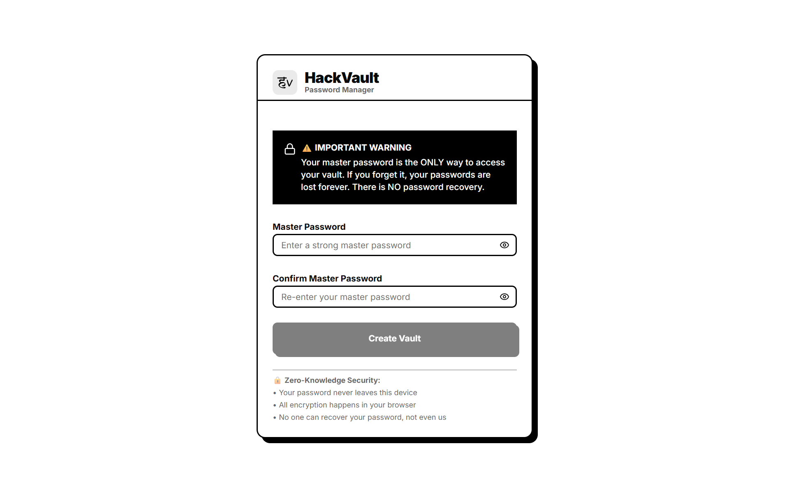
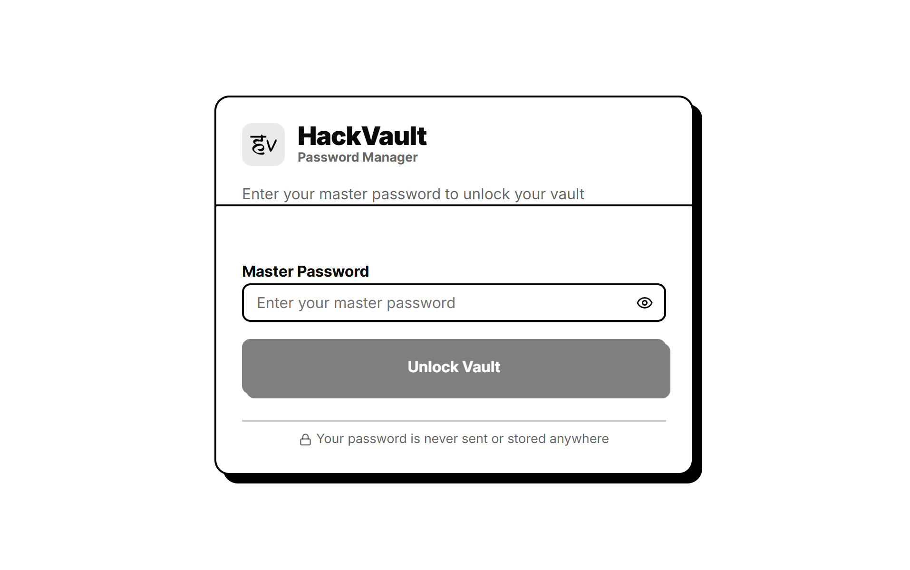
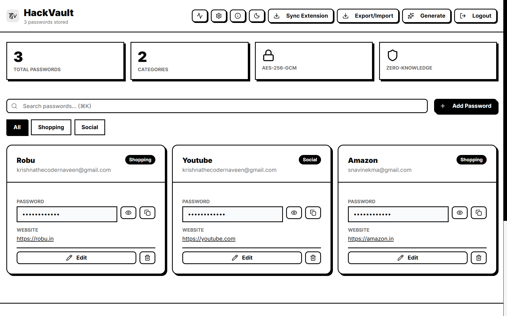
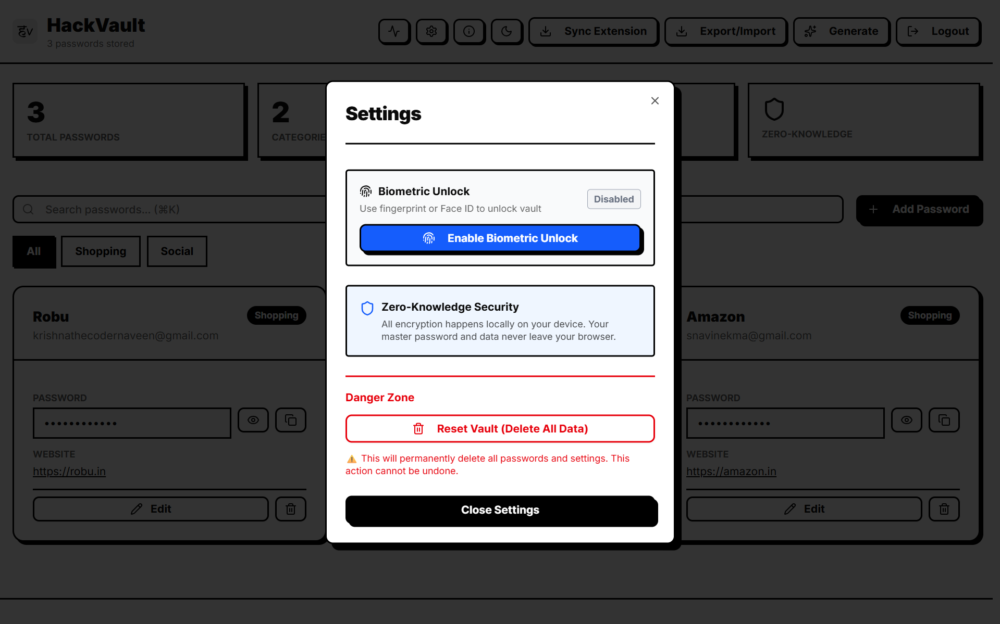

<div align="center">


# HackVault

**The Zero-Knowledge Password Manager for the Modern Web** 🔐

[](https://nextjs.org/)
[](https://www.typescriptlang.org/)
[](./LICENSE)
[](https://en.wikipedia.org/wiki/Galois/Counter_Mode)

[🚀 Live Demo](https://hackvault-jarvis.vercel.app) • [📖 Docs](#quick-start) • [🐛 Issues](https://github.com/yuvakrishnas/hackvault/issues) • [⭐ Star us!](https://github.com/yuvakrishnas/hackvault)

</div>

---

## 🎯 What is HackVault?

HackVault is a **zero-knowledge password manager** that puts you in complete control of your secrets. Your passwords are encrypted client-side with AES-256-GCM before they ever leave your browser. We never see them. Nobody does.

No central servers storing your master password. No account recovery (by design). No subscription fees. Just pure, unapologetic security.

---

## ✨ Features

### 🔓 **Smart Autofill**
One-click password autofill on login forms. Auto-detects credential fields and fills them securely without storing sensitive data in memory longer than necessary.

### 🎲 **Military-Grade Password Generator**
Create unbreakable passwords with customizable length, character sets, and entropy requirements. Cryptographically secure random generation using the Web Crypto API.

### 📴 **Offline-First Architecture**
Your vault works completely offline. Store everything locally in IndexedDB. Sync is optional—sync to cloud storage of your choice (or don't).

### 🔐 **Zero-Knowledge Encryption**
AES-256-GCM encryption means your data is locked with a key only you possess. We've engineered it so we literally cannot decrypt your vault even if we wanted to.

### ⚡ **Lightning Fast**
Built on Next.js 14 with server-side rendering where it makes sense and client-side encryption everywhere it matters. No network latency on core operations.

---

## 🏗️ Tech Stack

| Layer | Technology |
|-------|-----------|
| **Framework** | Next.js 14 (App Router) |
| **Language** | TypeScript 5.x |
| **Encryption** | Web Crypto API (AES-256-GCM) |
| **Storage** | IndexedDB (offline-first) |
| **UI** | React 18 + Tailwind CSS |
| **State** | TanStack Query + Zustand |
| **Build** | Turbopack |

---

## 🔐 Security Architecture

### How does zero-knowledge encryption work?

<details>
<summary><strong>Click to expand: Technical breakdown</strong></summary>

#### Key Derivation
Your master password is **never stored**. Instead, we derive a cryptographic key using PBKDF2 (Password-Based Key Derivation Function 2) with 100,000 iterations and a random salt.

```
Master Password → PBKDF2 (100k iterations) → 256-bit Key
```

#### Encryption: AES-256-GCM
Every password, note, and credential is encrypted using **AES-256 in Galois/Counter Mode (GCM)**. GCM provides:
- **Confidentiality**: AES-256 encryption (256-bit key = 2^256 possible keys)
- **Authenticity**: GMAC authentication tag prevents tampering
- **No IV reuse**: Random 96-bit nonce for each encryption

```
Plaintext + Key + Nonce → AES-256-GCM → Ciphertext + Auth Tag
```

#### Client-Side Execution
All encryption/decryption happens in your browser using the **Web Crypto API**:
- Zero server-side encryption code
- No plaintext ever transmitted
- Browser memory is cleared after use

#### The Math
- **AES-256**: ~2^256 possible keys (340 undecillion combinations)
- **Brute force**: At 1 trillion attempts per second, it would take ~10^67 years to crack
- **PBKDF2 + 100k iterations**: Slows down password cracking by 100,000x

</details>

### What about metadata?

We collect minimal metadata: vault creation date, last updated timestamp. No usernames, no hints, no account recovery emails. This data is **not encrypted** (you need it for UI purposes), so never trust metadata security.

---

## 🚀 Quick Start

### Prerequisites
- Node.js 18.17+
- npm, yarn, or pnpm

### Installation

```bash
# Clone the repository
git clone https://github.com/yuvakrishnas/hackvault.git
cd hackvault

# Install dependencies
npm install
# or
yarn install
# or
pnpm install

# Set up environment variables (optional for local development)
cp .env.example .env.local

# Start the development server
npm run dev
# or
yarn dev
# or
pnpm dev
```

Open [http://localhost:3000](http://localhost:3000) in your browser. Start storing passwords with **zero-knowledge encryption**.

### Build for Production

```bash
npm run build
npm run start
```

---

## 📸 Screenshots

| Feature | Screenshot |
|---------|-----------|
| **Create Master Password** |  
| **Enter Master Password** |  |
| **Onboardig Welcome** |  |
| **Vault Dashboard** |  |
| **Security Settings** |  |

---

## 🎓 How It Works

### 1. **First Time Setup**
You create a master password. We derive a key from it using PBKDF2.

```
Your Master Password (never stored)
         ↓
    PBKDF2 (100k iterations)
         ↓
    256-bit Encryption Key (stored in RAM only during session)
```

### 2. **Storing a Password**
You add a new credential. It gets encrypted with your key before anything leaves your browser.

```
plaintext password → AES-256-GCM encrypt → stored locally in IndexedDB
```

### 3. **Autofill**
Browser detects login form → checks vault → decrypts password → autofills → clears from memory.

### 4. **Offline Access**
Everything in IndexedDB works offline. No network = no problem.

---

## ❓ Why No Chrome Store?

We deliberately chose not to publish on the Chrome Web Store. Here's why:

**The $5 Entry Fee**
Google's $5 developer registration fee isn't the barrier—it's principle. We believe security tools should be **freely accessible** to everyone, regardless of economic status. A $5 fee creates friction and gatekeeping.

**Decentralization**
Distributing via GitHub means:
- ✅ Full transparency—read every line of code
- ✅ Build it yourself—no trust in pre-built packages
- ✅ No corporate store policies limiting functionality
- ✅ Direct updates—you control when/what you install

**How to Install Locally**
1. Clone this repo
2. Run `npm run build`
3. Go to `chrome://extensions`
4. Enable **Developer Mode**
5. Click **Load Unpacked** → select the `dist` folder

We'd rather 100 developers read our source code than 10,000 click "Add to Chrome."

---

## 🔧 Development

### Project Structure

```
hackvault/
├── app/                    # Next.js App Router
│   ├── api/               # API routes (minimal)
│   ├── vault/             # Main app pages
│   └── layout.tsx         # Root layout
├── lib/
│   ├── crypto/            # Encryption utilities
│   ├── storage/           # IndexedDB wrappers
│   └── types/             # TypeScript interfaces
├── components/
│   ├── VaultDashboard/    # Main UI components
│   └── Generator/         # Password generator
└── public/                # Static assets
```

### Running Tests

```bash
npm run test
npm run test:coverage
```

### Code Quality

```bash
# Lint
npm run lint

# Type check
npm run typecheck

# Format
npm run format
```

---

## 🛡️ Security Considerations

### What HackVault Protects
- ✅ Encryption at rest (IndexedDB)
- ✅ End-to-end encryption (zero-knowledge)
- ✅ Protection against server compromise
- ✅ Cryptographically strong random generation

### What It Doesn't (Out of Scope)
- ❌ Malware on your device (malware can read your screen/keyboard)
- ❌ Phishing attacks (social engineering)
- ❌ Weak master passwords (use a passphrase!)
- ❌ Browser extensions tampering (use trusted browsers only)

### Best Practices
1. **Use a strong master password**: Minimum 12 characters, mix of character types
2. **Enable browser fingerprint lock**: Require re-authentication on new devices
3. **Disable autofill on sensitive sites**: Credit card numbers, bank transfers
4. **Keep your OS updated**: Patch vulnerabilities in your operating system
5. **Review permissions**: This app requests minimal permissions

---

## 🤝 Contributing

We welcome contributions from security researchers and developers!

### Before Submitting a PR
1. Read [CONTRIBUTING.md](./CONTRIBUTING.md)
2. Fork the repository
3. Create a feature branch: `git checkout -b feature/amazing-feature`
4. Commit changes: `git commit -m 'Add amazing feature'`
5. Push to branch: `git push origin feature/amazing-feature`
6. Open a Pull Request

### Security Issues
**Please do NOT open a public issue for security vulnerabilities.**
Email us at `krishnathecodernaveen@gmail.com` with:
- Description of the vulnerability
- Steps to reproduce
- Potential impact

---

## 📄 License

This project is licensed under the **MIT License** - see [LICENSE](./LICENSE) file for details.

---

## 🙏 Acknowledgments

- [Web Crypto API](https://developer.mozilla.org/en-US/docs/Web/API/Web_Crypto_API) for secure encryption
- [Next.js](https://nextjs.org/) for the amazing framework
- [IndexedDB](https://developer.mozilla.org/en-US/docs/Web/API/IndexedDB_API) for offline-first storage
- Our contributors and security researchers

---

## 📞 Support

- 🐛 **Report Bugs**: [GitHub Issues](https://github.com/yuvakrishnas/hackvault/issues)
- 💬 **Discussions**: [GitHub Discussions](https://github.com/yuvakrishnas/hackvault/discussions)
- 📧 **Email**: krishnathecodernaveen@gmail.com

---

<div align="center">

**Built with 🔥 by the HackVault team**

Your secrets deserve better than the cloud. Keep them local. Keep them encrypted. Keep them **yours**.

[Back to top](#hackvault)

</div>